# Blind Second — 1v1 Blind Reflex Duel

A 1v1 online party game where two players duel on timing and reflexes without a visible clock. Built to solve a specific problem: **how to measure reaction time fairly when both players have different ping**.


## The Problem

In a 1v1 timing game, if the server records *when it receives the press RPC*, the player with 150ms ping always loses to the player with 20ms ping — even with a faster actual reaction. I needed to measure "when the player pressed" rather than "when the server heard about it."

## The Solution

- **Client timestamp submission**: clients send `NetworkManager.LocalTime.Time` (RTT-corrected clock). The server reconstructs elapsed time from the player's own machine, decoupled from network latency.
- **Authoritative server**: target time is a private server field, never a `NetworkVariable`. All input RPCs validate sender identity and game phase server-side.
- **One clock for display and measurement**: `CountdownUI` uses the same `LocalTime` clock that measures the press, so what the player sees matches what gets scored.
- **Hang-protection**: every server-wait state has a timeout. An AFK or disconnected opponent can never softlock the match.

&gt; An earlier version subtracted `RTT/2` on top of Netcode's already-corrected `LocalTime`, double-penalizing high-ping players. Removing that fixed the core fairness problem.


## Quick Facts

| | |
|---|---|
| **Networking** | Netcode for GameObjects, Unity Relay (P2P via join code), server-authoritative state machine |
| **Anti-cheat** | Private server fields, sender validation on every RPC, no client-side round secrets |
| **Input** | 3D ray-cast buttons (not UI `OnClick`), DOTween press animations |
| **Modes** | Precision, Interval Guess (setter/guesser), Cooperative — one shared pipeline |
| **Resilience** | Server timeouts on every client-wait phase; connection-loss detection |
| **Latency tested** | 20–200ms simulated |


## Round State Machine

```mermaid
graph TD
    A[WaitingReady] --> B[Countdown]
    B --> C[Suspense]
    C --> D[WaitingForInput]
    C --> E[SettingStart]
    E --> F[SettingEnd]
    F --> D
    D --> G[Results]
    
    style E fill:#333,stroke:#666
    style F fill:#333,stroke:#666
```

All transitions are server-side. Every `NetworkVariable` is `WritePermission.Server`. UI only reacts to value changes, never predicts.

## Architecture

- **GameManager** → server-authoritative round state machine, private target time
- **LobbyManager** → ready-check, mode voting, `NetworkList;PlayerLobbyState;`
- **RelayManager** → Unity Relay allocation, join codes, connection handling
- **One pipeline, three modes** — all modes share `Submit → Resolve → Reveal` path.
- **Events over polling** — UI subscribes to `GameEvents` instead of reading `NetworkVariable`s every frame.
- **Static bridge** — `MatchSettings` carries lobby data between scenes without `DontDestroyOnLoad`.

## Networking Deep Dive

<details>
<summary>Click to expand: lag compensation, clock sync, and anti-cheat</summary>

### Fair Timing Over Unfair Network

**The naive approach**: server records `Time.time` when RPC arrives.  
**The problem**: 150ms ping = automatic 150ms penalty.  
**The fix**: client sends `NetworkManager.Singleton.LocalTime.Time` (already RTT-corrected). Server calculates:

```csharp
float pressedAt = (float)(clientLocalTime - TimerStartServerTime.Value);
```

### Why LocalTime, not ServerTime

`ServerTime` is smoothed/buffered for object interpolation and lags behind real "now." Using it for display while using `LocalTime` for measurement creates desync. Both systems use the same clock.

### Hang-Protection

Every phase that waits on client input (`WaitingForInput`, `SettingStart/End`) has a server-side timeout. If a client disconnects or goes AFK, the server resolves the round automatically after N seconds instead of hanging forever.

### Authoritative Anti-Cheat

- `_targetTime` and setter values are private server fields, not `NetworkVariables`.
- Every `[ServerRpc]` validates `SenderClientId` and `State.Value` before accepting anything.
- Results revealed through a single `[ClientRpc]` after full server resolution.

</details>

## What I Learned

- **Double-compensation bug** (see Networking Deep Dive above): the fix was removing code, not adding it — networking fixes can be subtractive.
- **One clock rule:** aligning `CountdownUI` and scoring to the same `LocalTime` eliminated desync complaints in playtests.
- **Hang-protection by default:** every server-wait state needs a timeout. An AFK opponent softlocking the match is a failure of the developer, not the player.
- **Physical over UI:** ray-cast 3D buttons felt more satisfying than `OnClick`, but required handling edge cases (clicking during animation, double-clicks). UX details matter even in simple mechanics.
- **Shared pipeline:** three modes through one `ResolveRound()` meant 3× less bug surface. The upfront abstraction paid off immediately when adding Cooperative mode.
- **Chat input lock**: separating gameplay input from UI input (chat open → 
  Space/Click don't trigger game buttons) required a global input state flag. 
  Simple in hindsight, easy to forget in implementation.

## Tech Stack

- Unity 2022.3 LTS
- Netcode for GameObjects
- Unity Relay & Authentication
- DOTween
- TextMeshPro

## How to Run

<table>
  <tr>
    <td width="50%">
      
    </td>
    <td width="50%">
      
    </td>
  </tr>
</table>

You can download and run:
**[Download on itch.io](https://vertexvrtx.itch.io/blind-secondcoop)**

**or**
  
1. Open in Unity 2022.3+, load MainMenu scene.
2. Host: Create room → copy join code. Guest: Enter code → connect.
3. For local testing: use Multiplayer Play Mode (Editor + standalone build).
